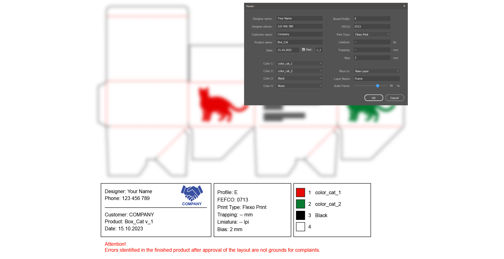

# AutoFrame
The script creates a frame with the technical data of the layout. After filling in the fields, the script will insert a frame from the "Template.svg" file and with the entered data.

# Installation
You can run the script without installation right away by selecting the menu File → Scripts → Other Script, then Illustrator will ask you to specify the location of the file or drag the script file onto the Illustrator window with the mouse.

# Download
Download [script](https://github.com/VGmove/AdobeScripts/releases/download/v1.0.0/AutoFrame.zip).
