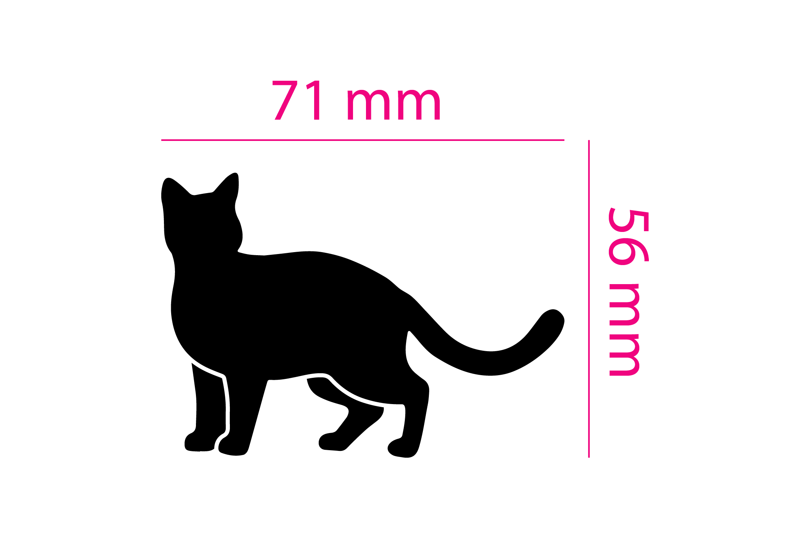

# Dimension
The script measures the length of the selected lines and creates a measurement symbol from it. The measurements appear in a new layer.

# Installation
You can run the script without installation right away by selecting the menu File → Scripts → Other Script, then Illustrator will ask you to specify the location of the file or drag the script file onto the Illustrator window with the mouse.

# Download
Download [script](https://github.com/VGmove/AdobeScripts/releases/download/v1.0.0/Dimension.zip).
